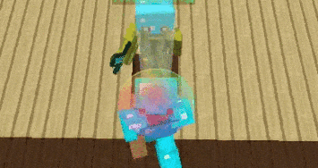

import Chip from '@mui/material/Chip'
import VerifiedUserIcon from '@mui/icons-material/VerifiedUser'

# Jump Reset <Chip label="Ghost" color="success" size="small" component="a" href="/guides/anticheat-safety#risk-labels" icon={<VerifiedUserIcon />}/>

Jumps the moment knockback lands so the ground cuts it short

---

### Chance %

How often to reset at all. Rolled once when the knockback arrives.

### Accuracy %

Once a reset is on, the chance each tick that the jump actually goes out. A missed roll does not
cancel the jump, it delays it a tick, so a low accuracy gives you late and sloppy resets rather
than none. Randomised inside the range every attempt.

### Only when targeting

Only reset while you are roughly facing the nearest player within 6 blocks.

### Water check

Skip the reset while you are in water.
