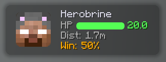
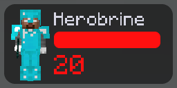
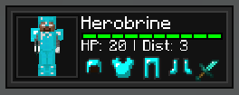
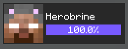
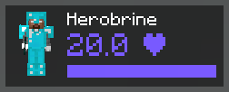

# Target HUD

Displays target info and fight prediction when in combat

---

### Font

Font used for this element's text. **DEFAULT** follows the client font set in **Font**, and any
other choice overrides it for this element only.

### Position

Choose whether the HUD is static or floating.

- **STATIC**: fixed on-screen position
- **FLOATING**: follows the target smoothly from the side

### Design

Visual style of the target HUD. (All of these are shown with the Minecraft font,
however you can customize that too).

- **GRIZZLY**: Grizzly Client's original target hud

- **CAMEL**: ported version of Camel Client's target hud

- **EXHIBITION**: ported version of Exhibition's target hud

- **NOVOLINE**: ported version of Novoline's target hud

- **ASTOLFO**: ported version of Astolfo's target hud

- **WURST**: ported version of Rise's Wurst target hud

### BG color

Background color for the target HUD, with alpha support. The Exhibition design composites
it over its own dark panel fill, so alpha darkens the panel rather than exposing the bezel.

### Background mode

Controls the Grizzly design's panel background.

- **SOLID**: use **BG color** as a normal background
- **BLUR**: apply a rounded Gaussian blur to the gameplay behind the HUD and use **BG color** as a glass tint

### Blur strength

Controls the blur radius for the Grizzly design when **Background mode** is **BLUR**.

### Drop shadow

Draw a GPU-rendered soft shadow behind the Grizzly design. Configure its color and opacity, softness, spread, and X/Y offset. This setting does not alter the Camel or Exhibition designs.

### Text shadow

Draw a shadow behind HUD text.
