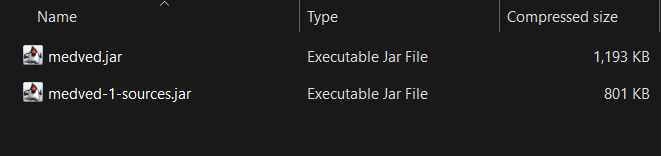
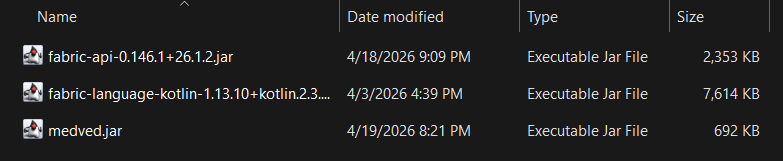

---

---
import ExperimentalVersion from '@site/src/js/mcVersion/experimental'

# Installation

:::info
This mod was made for Minecraft version <ExperimentalVersion/>, using it on any other version will not work.
:::

## Downloading the latest build

Download the [Artifacts.zip](https://git.luka.onl/luka/GrizzlyClient/actions?workflow=build.yml&actor=0&status=1) file,
there should be two files here, the only one we want is `medved.jar`.

Copy that file or extract it, and place it in your mods folder:

