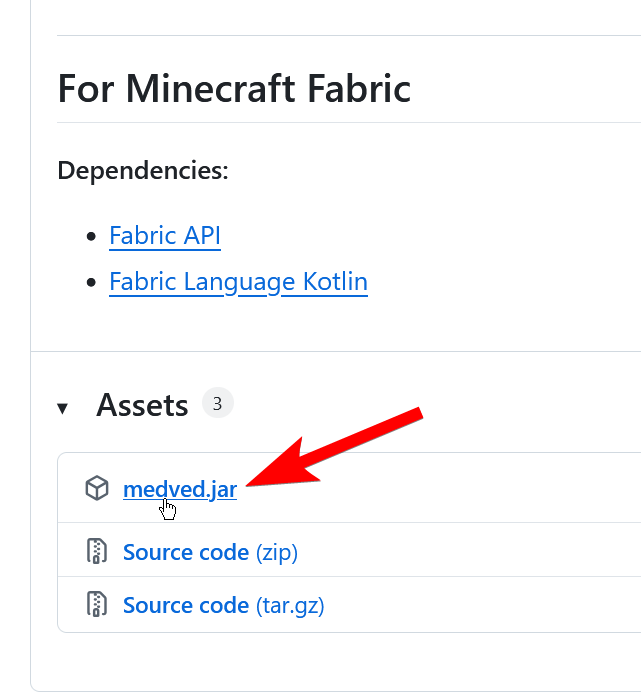

---

---
import ReleaseVersion from '@site/src/js/mcVersion/release'

# Installation

:::info
This mod was made for Minecraft version <ReleaseVersion/>, using it on any other version will not work.
:::

## Downloading the latest release

Go onto the project's [latest release page](https://git.luka.onl/luka/GrizzlyClient/releases) and download `medved.jar`.

Once you've downloaded the `medved.jar`, place it in your mods folder:

